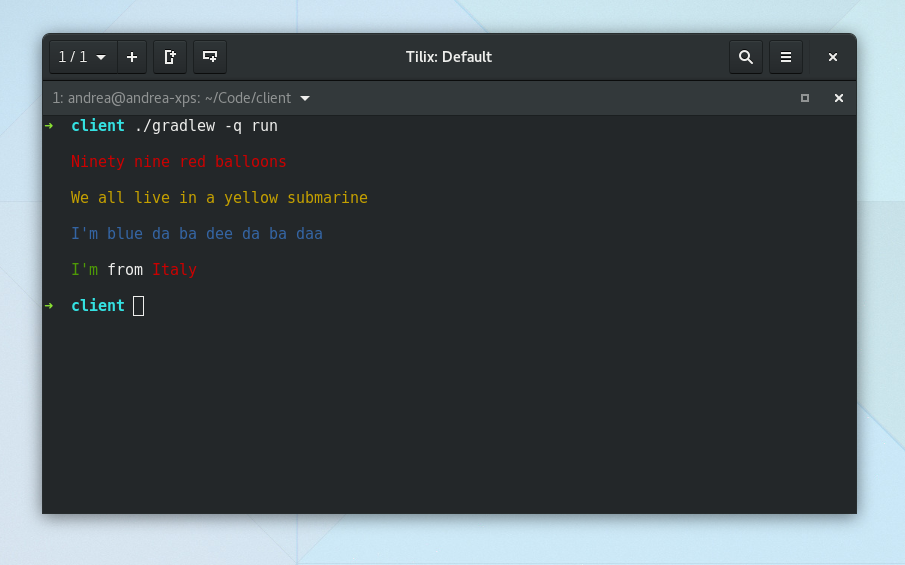

# kolor

[ ](https://bintray.com/ziggy42/kolor/kolor/_latestVersion)   
A library to print colored strings, with Kotlin.



## Example
Foreground:
```kotlin
println("We all live in a yellow submarine".yellow())
// Or
println(Kolor.foreground("We all live in a yellow submarine", Color.YELLOW))
// Or
println("We all live in a yellow submarine".color(Color.YELLOW))
```

Background:
```kotlin
println("I'm blue da ba dee da ba daa".blueBackground())
// Or
println(Kolor.background("I'm blue da ba dee da ba daa", Color.BLUE))
```

## Usage
Add jcenter:
```groovy
repositories {
    jcenter()
}
```

Add dependency:
```groovy
dependencies {
    implementation "com.andreapivetta.kolor:kolor:1.0.0"
}
```
